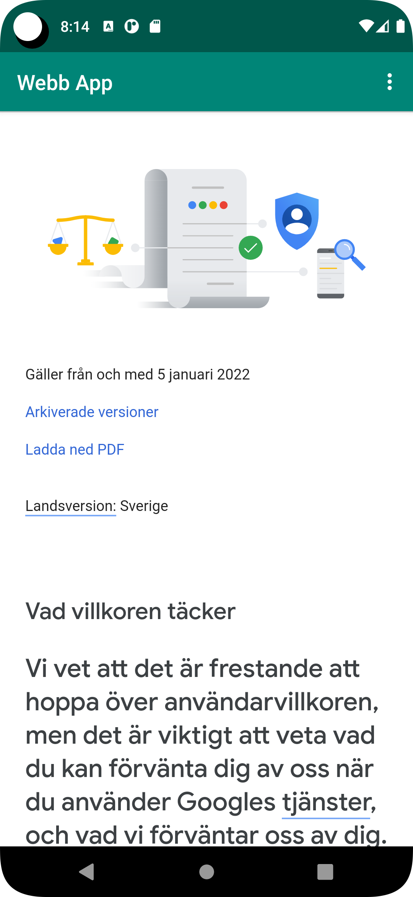

# Rapport

ändrat namn på appen till "webb-app".
Enablaat internet till appen.
skapade webview element och tog bort den gamla text veiw elementet.
missa här dock att jag skulle pusha min githubfork då jag i bärjan följde instruktionerna på hemsidan
sen la jag till all extrakod som behövs för att få appen att fungera.
efter jag bytte loadUrl till showExternal/Internal bytte jag Internal till google för att man skulle se skillnaderna på screen-shots    


```
 public void showExternalWebPage() {
        // TODO: Add your code for showing external web page here
        myWebView.loadUrl("https://his.se");
    }

    public void showInternalWebPage() {
        // TODO: Add your code for showing internal web page here
        myWebView.loadUrl("https://google.se");
    }

    @Override
    protected void onCreate(Bundle savedInstanceState) {
        super.onCreate(savedInstanceState);
        setContentView(R.layout.activity_main);

        Toolbar toolbar = findViewById(R.id.toolbar);
        setSupportActionBar(toolbar);

        myWebView = findViewById(R.id.my_webview);
        myWebView.setWebViewClient(new WebViewClient()); // Do not open in Chrome!
        myWebView.getSettings().setJavaScriptEnabled(true);
}
```




